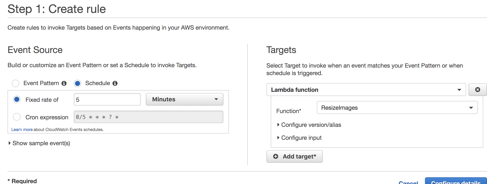
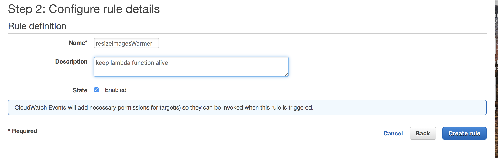
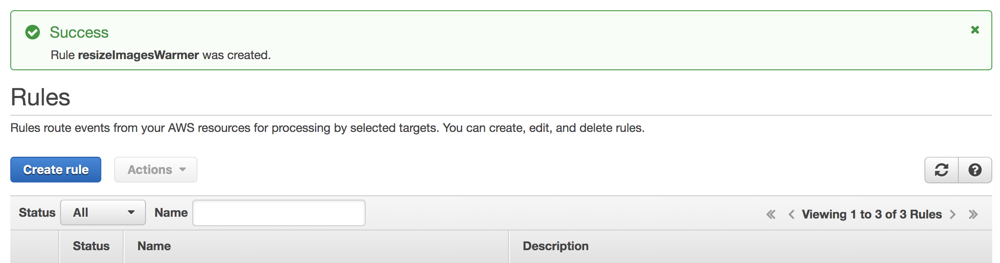
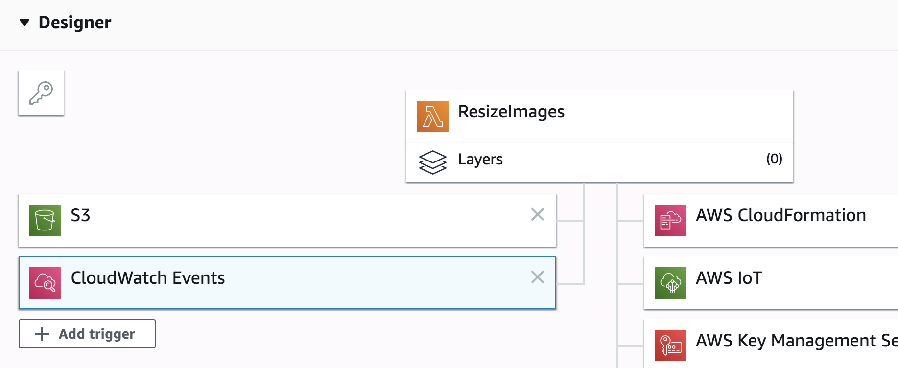
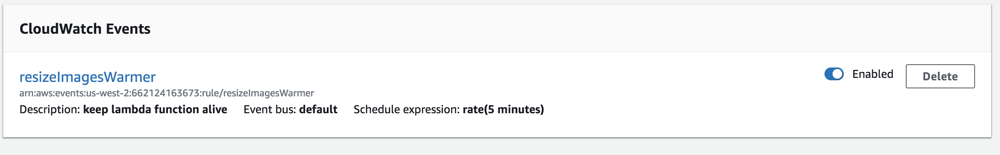
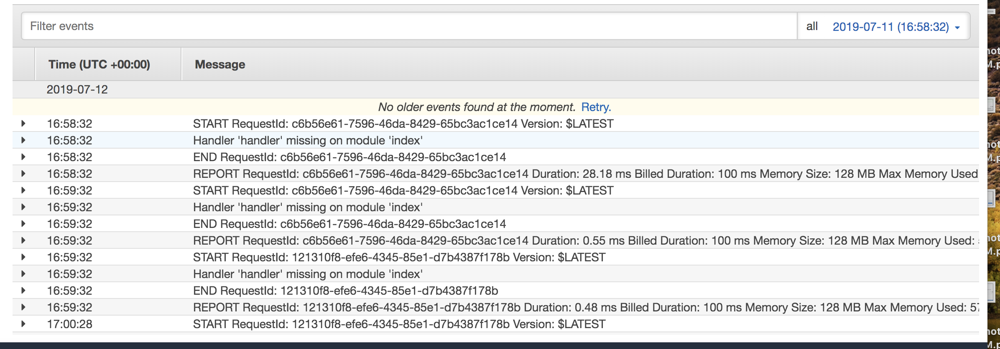

#Taskmanager Front-end

Depolioyed link: https://master.d23irg4g92t4ud.amplifyapp.com/

Backend link: http://x88l.us-east-2.elasticbeanstalk.com/tasks

#Description

Build a font end website for taskmanger. List all the tasks available from api.

Includes:

Title of the task,

Description of the task,

Status of the task,

Whom the task assigned to(if nobody will show "unassigned" if has assignee will show the name)

uploading image file to the site , and will display both original and resized images

# Technology

React js 

Aws amplify for deployed version 

S3 for storing the pics(files)

Lambda create function for resizing the pic image and whenever user create file online it will trigger the lambda function

to resize the image and save resized image to the resized bucket. 

Using lambda warmer to keep the resizeImage lambda function awake.

for the role, you might need (cloudwatcheventfullaccess & cloudwatchlogfullaccess policies)

How to create cloudwatch:

Step: 1 (chose the target lambda you want to keep alive)

Step: 2

Successfully create the rule

After create that, go back to lambda function,there will be a cloudwatch events showed up 

At the bottom of the same page you will see the warmer you just created

For the test part:

created testwarmer function on the lambda, set up cloudwatch 

And go to the monitoring, you will see the cloudwatch log

# Display

# reference

solve the "No Access-Control-Allow-Origin" issue by using 'cors':

https://stackoverflow.com/questions/43871637/no-access-control-allow-origin-header-is-present-on-the-requested-resource-whe/43881141