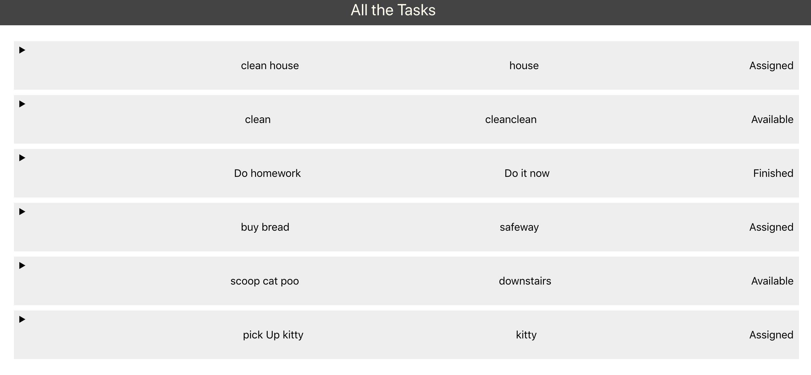

#Taskmanager Front-end

Depolioyed link: https://master.d23irg4g92t4ud.amplifyapp.com/

Backend link: http://x88l.us-east-2.elasticbeanstalk.com/tasks

#Description

Build a font end website for taskmanger. List all the tasks available from api.

Includes:

Title of the task,

Description of the task,

Status of the task,

Whom the task assigned to(if nobody will show "unassigned" if has assignee will show the name)

# Technology

React js 

Aws amplify for deployed version 

# Display

# reference

solve the "No Access-Control-Allow-Origin" issue by using 'cors':

https://stackoverflow.com/questions/43871637/no-access-control-allow-origin-header-is-present-on-the-requested-resource-whe/43881141